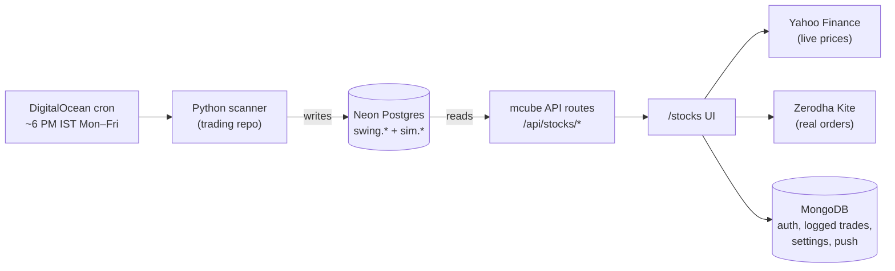

# Stocks Section — End-to-End Functional Behaviour

> **Scope:** The `/stocks` route group in mcube (frontend) + the `C:\Projects\trading` scanner (backend).
> **Last verified against code:** 2026-06-12.
> This doc describes how the system behaves **today**. Planned-but-unbuilt work is called out explicitly in §8.

---

## 1. System Overview

Two repos, one database:

| Repo | Role | Hosting |
|---|---|---|
| `C:\Projects\trading` | Python scanner. Runs on a daily cron, computes swing-trade entry signals, simulates a paper portfolio, writes everything to Neon Postgres. No HTTP API. | DigitalOcean droplet (cron), deployed via GitHub Actions on push to `master` |
| `C:\Projects\mcube` | Next.js 16 app. The `/stocks` route group reads those Postgres tables via its own API routes and renders signals, performance, and portfolio. Handles auth, manual trade logging (MongoDB), live prices (Yahoo), and real order placement (Zerodha Kite). | Vercel |

---

## 2. Backend: The Daily Scan (trading repo)

### 2.1 Schedule

- Cron: **Mon–Fri, 12:30 UTC = 6:00 PM IST** (after NSE close).
- Configured command: `python main.py --save` — the new `main.py` strips CLI flags on startup, so the stale `--save` is harmless.
- The legacy 7-strategy swing scanner survives as `scanner/main_sanjay.py --save` (ad-hoc runs / paper trial — see §8.2).

### 2.2 What one run does (current `main.py` — the ML orchestrator, since 2026-06-11)

`main.py` is now a 3-step orchestrator built on the post-backtest winning strategies:

1. **`daily_suggestor.run_daily.main()`** (external repo, sibling path `C:\Projects\daily_suggestor`, not in the trading repo):
   - Refreshes local daily OHLCV CSVs for a **~1700-ticker universe** via batched yfinance.
   - **Resolves open positions** (closes trades; this is where sell decisions come from).
   - Scores the **6 ML strategies**, dedupes, saves new trades with status `OPEN_PENDING_FILL`.
   - Sends an ntfy push with buys and sells.
2. **`swing_mr` scan** against the freshly refreshed CSVs (no second download): top 5 by volume ratio → `swing.mean_reversion_signals` (+ new `invested_rs` column = capital per trade from `config.get_invest_for_strategy`), then `log_new_signals()` opens paper positions in `swing.strategy_performance`.
3. **Summary ntfy** with the MiRana buy rows (`symbol | entry range | T target | SL stop | MiRana`).

### 2.3 Active strategy roster (7 "heroes", from the Jan–May 2026 backtest)

| Strategy key | Hero name | Idea | Backtest (Jan–May 2026) | Where it persists |
|---|---|---|---|---|
| `s05_garch_volume` | **GARudaVahana** | GARCH volatility + volume | 104 trades, +3.94% avg, +₹40,159 | inside `daily_suggestor` (see §8.1) |
| `s07_wavelet_volume` | **Wayuputra** | Wavelet volume patterns | 167 trades, +1.87%, +₹30,587 | inside `daily_suggestor` |
| `sanjay_xgb_b8` | **Gobin xood** | XGBoost feature model | 137 trades, +2.06%, +₹28,246 | inside `daily_suggestor` |
| `s08_gap_momentum` | **GaMomra** | Gap + momentum continuation | 12 trades, +7.50%, +₹9,000 | inside `daily_suggestor` |
| `s06_tcn_ohlcv` | **TeCNa** | Temporal CNN on OHLCV | 132 trades, +0.46%, +₹6,092 | inside `daily_suggestor` |
| `s11_cluster_meanrev` | **KlaMeReous** | Cluster mean-reversion | 30 trades, +1.77%, +₹5,300 | inside `daily_suggestor` |
| `swing_mr` | **MiRana** | Oversold bounce at support (RSI<35, 200 EMA / 60d low, reversal candle) | 48 trades, +0.75%, +₹3,616 | `swing.mean_reversion_signals` + `swing.strategy_performance` |

**Being promoted (planned, not yet in `main.py`):** `rs_resilience` **and `ema_pullback`** (decision 2026-06-12) — restoring the full original scope of `trading/docs/PRD-rs-ema-exit-signals.md`. RS's backtest exclusion (−₹29,714) was a data artifact (no Nifty series, so Mansfield RS was skipped), and it was the top live paper earner over 20 May–8 Jun; EMA rejoins alongside it with the same trend-break exit engine (see §8.2). The mcube UI already treats both as active roster.

**Benched (excluded from the daily run, kept for a longer paper trial):** `breakout`, `fib_pullback`, `vcp`, `fear_reversion`. Their tables and history remain; `main_sanjay.py` can keep paper-trading them (§8.2).

**Separate pipeline:** `manish` → `sim.stock_suggestions` (z-score / peer slope, tracked with real closes) — unchanged.

### 2.4 Signal row shape (all `swing.*_signals` tables)

`date, symbol, company_name, cmp, breakout_level, entry_min, entry_max, target, stop_loss, volume_ratio, rsi, signal_strength` — the buy zone is `entry_min..entry_max`; `signal_strength` is `Strong`/`Moderate`.

### 2.5 Paper portfolio table — `swing.strategy_performance`

One row per simulated trade: `signal_date, strategy, symbol, entry_price, target_price, stop_loss_price, investment (₹10k), exit_date, exit_price, exit_reason (target_hit | stop_loss | timeout), pnl, pnl_pct, status (open | closed)`.

---

## 3. Frontend: `/stocks` Route Group (mcube)

### 3.1 Routing & navigation

Next.js App Router, route group `app/(stocks)/`. Three nav tabs (desktop sidebar / mobile bottom bar):

| Tab | URL | Page |
|---|---|---|
| Signals | `/stocks` | `UnifiedSignalsPage` — the main screen |
| Simulated | `/stocks/performance` | Paper-portfolio analytics |
| Portfolio | `/stocks/portfolio` | Real trades, Kite holdings/positions |

Plus `/stocks/settings` (gear icon). Old per-strategy URLs (`/stocks/breakout` etc.) just redirect to `/stocks?strategy=...`.

### 3.2 `/stocks` — Unified Signals page

**Data load (parallel on mount):**
- `GET /api/stocks/signals/all` → all 8 sources merged into `UnifiedSignal[]` (`lib/stocks/signal-helpers.ts` + `signal-mappers.ts`). Swing tables are queried for their latest `date` only; Manish has full history.
- `GET /api/stocks/trades?status=open` → which signals the user has logged buys against (MongoDB).
- `GET /api/stocks/swing/performance` → simulated closes (last 14 days shown on the Closed view).
- `GET /api/kite/status` + `GET /api/kite/holdings` → broker connection + real holding quantities.
- `GET /api/stocks/settings` → default trade amount (₹).
- Then `GET /api/stocks/current-price?tickers=…` → live prices from Yahoo (`.NS`), shown with a LIVE badge.

**Filters (URL-driven):** `strategy` (one of the 8 keys or All), `status` (`open` default / `closed`), `fresh=1` (latest scan date only).

**Each open signal card (`UnifiedSignalCard`) shows:**
- Ticker, strategy badge + colour stripe, signal date (IST).
- Entry zone (`entry_min–entry_max`), Target, Stop Loss, CMP-at-scan.
- Live price + unrealized % vs entry midpoint (computed client-side).
- R:R ratio, `Vol Nx` pill, `RSI` pill; Manish cards add entry z-score and peer slope.
- Actions: **Kite Buy** (limit order, qty = default amount ÷ LTP, optional GTT target/SL exit), **Log buy** (manual record in MongoDB), strategy info drawer (static explainer copy).
- If Kite holding exists for the ticker → **Sell** action appears.

**Closed view:** Manish real closes (entry/exit, hold days, realized %) + simulated swing closes from `strategy_performance` (last 14 days), with a banner clarifying sim closes are not real trades.

### 3.3 `/stocks/performance` — Simulated

Reads `swing.strategy_performance` (last 60 days) + Manish history. Strategy tabs, 4 KPI cards (Total P&L, Win Rate, Best Trade, Avg P&L), cumulative P&L line, per-trade bars, outcome breakdown, paginated trade table with live prices for open sim positions.

### 3.4 `/stocks/portfolio` — Real money

Tabs: **Overview** (P&L analytics across logged trades + Kite history, tracking starts 2026-06-01), **Logged Trades** (MongoDB `UserTrade` — edit target/SL, close via sheet), **Holdings** (Kite CNC), **Positions** (Kite intraday).

### 3.5 `/stocks/settings`

Account, Kite connect/disconnect (OAuth), default trade amount, push-notification toggle, user management (admin = `sanjay`).

### 3.6 Cross-cutting

- **Auth:** better-auth (MongoDB), username login at `/auth/stocks-login`, gate in `app/(stocks)/layout.tsx` (`session.user.section === "stocks"`). 1-year session.
- **Push:** Web-push (VAPID) via service worker; notification bell + read tracking.
- **Kite orders:** 5-second cancel-window toast after placing; GTT validation in `lib/kite/gtt-exit.ts`.
- **Theme:** Light, professional — Tailwind v4, white cards on `#F8FAFC`, slate text, no component library, Recharts for charts.

---

## 4. Buy / Sell / Hold Semantics (how a human uses it)

There is no `action` column in the DB. The behaviour is:

| State | How it manifests |
|---|---|
| **BUY** | A card on `/stocks` with today's scan date. Buy if price is inside `entry_min–entry_max`. User acts manually (Kite Buy or Log buy). The scanner independently opens a paper position. |
| **SELL** | The ML position resolver in `daily_suggestor` decides sells nightly — but today those only reach the user via **ntfy push**, not the UI (§8.1). The swing paper sim closes on target/stop/7-day timeout. In the UI, Kite Sell appears only because a holding exists. |
| **HOLD** | Implicit: an open logged trade / Kite holding with no close. The UI shows live unrealized P&L. |

---

## 5. Database Tables the Frontend Reads

| Table | Read by | Purpose |
|---|---|---|
| `swing.{breakout,ema,vcp,rs,mean_reversion,fib,fear_reversion}_signals` | `/api/stocks/signals/all` | Latest entry signals per strategy |
| `swing.strategy_performance` | `/api/stocks/swing/performance` | Paper trades (open + closed) |
| `sim.stock_suggestions` | `/api/stocks/signals/all`, performance route | Manish signals + real tracked closes |
| MongoDB: `UserTrade`, `StocksUserSettings`, notification + Kite session collections | trades/settings/push/kite routes | User-side state |

---

## 6. Environment Variables

| Var | Used for |
|---|---|
| `DATABASE_URL` | Neon Postgres (both repos) |
| `MONGODB_URI`, `AUTH_SECRET`, `BETTER_AUTH_URL` | mcube auth + app data |
| `KITE_API_KEY/SECRET`, `KITE_RELAY_URL/SECRET` | Zerodha |
| `VAPID_*` | Web push |
| `DB_SCHEMA` (trading, default `swing`) | Scanner schema |

---

## 7. Daily Timeline (user's point of view)

1. **6:00 PM IST** — cron runs the orchestrator; ML positions are resolved (sells) and new buys scored; MiRana signals land in Postgres; ntfy pushes buys/sells to the phone.
2. **Evening** — user opens `/stocks`, sees tonight's cards, checks live prices, places Kite buys or logs manual buys.
3. **Any time** — Portfolio tab shows real P&L; Simulated tab shows how each strategy is doing on paper.

---

## 8. Known Gaps / In-Flight Changes (as of 2026-06-12)

### 8.1 ML strategies — data contract found and wired (resolved 2026-06-12)

The 6 ML strategies persist their full trade lifecycle in Neon after all: schema **`daily_suggestor`** with `trades` (`trade_id, ticker, strategy, signal_date, status OPEN_PENDING_FILL|OPEN|CLOSED|CANCELLED, proba, signal_close, buy_range_low/high, target_pct, stop_pct, entry/exit prices+dates, exit_reason target|stop|time|outside_buy_range, pnl_pct (fraction), pnl_rs, invested_rs, hero`) and `daily_runs` (run telemetry). mcube now reads it directly:

- **War Room picks:** `/api/stocks/ml/signals` maps `OPEN_PENDING_FILL` rows to unified signals (top-2 `proba` per strategy per scan date = Divine tier).
- **Demo Mode:** the performance API merges ML trades (excluding `CANCELLED`) and computes per-strategy stats; `pnl_pct` is converted from fraction to percent to match the swing tables.

Remaining gap: nightly **sell** decisions still reach the user only via ntfy push — closed rows appear in the UI the next morning, but there is no dedicated RETREAT feed for ML positions (the `swing.exit_signals` table covers RS/EMA only, once Phase 0a lands).

Also unmapped: `swing.mean_reversion_signals.invested_rs` exists in the DB but isn't read by mcube's signal mappers yet.

### 8.2 RS promotion + the bench (planned)

**RS Resilience rejoins the active roster** (decision 2026-06-12). Its backtest exclusion was a data gap — the backtest had no Nifty series, so Mansfield RS could not be computed (`rs-ema-exit-redesign.md` §3.5) — and it was the top live paper earner (+₹3,026, 20 May–8 Jun, while Nifty fell 2%). The RS portions of `trading/docs/PRD-rs-ema-exit-signals.md` are back in scope: EOD exit engine (`trend_break` / `stop_loss` / `rs_fade` / `time_exit`), new `swing.exit_signals` table, one open position per symbol, 20-day backstop, profit ratchet (20→10 EMA at +8%). Requires adding an RS step to `main.py` plus a Nifty data feed (which also unblocks a proper RS backtest). **Not yet implemented.**

**The remaining four** (`breakout`, `fib_pullback`, `vcp`, `fear_reversion`) stay benched on an extended paper trial — paper writes to `swing.*_signals` + `strategy_performance` only via a `main_sanjay.py`-based cron step, no ntfy, no real-money prompts. Whether that step is wired on the DO box should be verified. Review the bench after ~3 months of parallel live paper data.

### 8.3 Stale docs

`docs/reference/stocks-section.md`, `components.md` and parts of `api-routes.md` describe the pre-consolidation UI (8 nav tabs, per-strategy pages, `/stocks/chart`). The current UI is the unified 3-tab layout described here.
